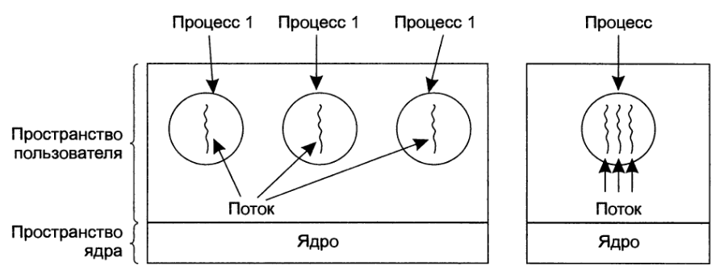

# 01.03.2024

# ОС/Лекция 3

За призовое место в хакатоне можно получить 5-7 баллов по операционным системам. Просто за участие можно получить +1 балл. За победу в хакатоне команда получается +10 баллов по ОС или зачёт по практике автоматом. Хакатон будет как по теме разработки ПО, так и по анализу данных.

# Многопоточность

## Потоки

Поток управления - наименьшая самостоятельная последовательность инструкций ЦП, выполенине которой может быть назначено планировщиком задач.

Подход с квантами выполнения не всегда удобен. Порой нам необходимо, чтобы несколько программ выполнялись действительно параллельно.

Во многих приложениях одновременно происходит несколько действий, часть из которых может быть заблокирована.

Потоки проще (быстрее) создаются и ликвидируются, чем процессы.

Повышение производительности для задач с большим объёмом вычислений и большим временем ожидания (эти действия за счёт потоков могут перекрываться) или при наличии несолкькх центральных процессоров.

Microsoft Word использует парадигму WYSIWYG. Предположим, нам нужно посмотреть, что находится на предпоследней странице достаточно большого документа (~200 с.). Для начала мы удалили что-то в начале документа. Теперь Ворду нужно будет пересчитать все положения абзацев, строк, заголовков и т.д. для того, чтобы корректно отобразить страницы, находящиеся много ниже изменённой.

Пересчитывая все остальные страницы, Ворд может зависнуть на некоторые время. Это не очень приятный UX. Мы можем улучшить ситуцаию, разделив просчёт и отрисовку на две части. В одном потоке будут выполняться расчёты, а в другом отрисовка обновлённого документа.

В рамках одного процесса мы можем запустить любое кол-во потоков. Концепция потоков ползволят обеспечить нам параллельное выполнение кода в рамках одного процесса.

Итак, мы выделили пересчёт все буковок, строк, абзацев, их положения на странице в отдельный поток. Под взаимодействие с пользователем мы выделим тоже отдельный поток. Например, на двухядерном процессоре два таких поток будут выполняться параллельно, что позволит значительно ускорить программу и отзывчивать интерфейса.

Потоки также используются на серверах.

| Модель | Характеристики                                                                                            |
| ------ | --------------------------------------------------------------------------------------------------------- |
| Потоки | Параллельная работа, блокирующие системные вызовы                                                         |
| Однопоточный процесс | Отсутствие параллельной работы, блокирующие системные вызовы                                |
| Машина с конечным чистом состояний (КНА) | Параллельная работа, неблокриюущие системные вызовы; сложная реализация |

Классический подход к одновременной и эффективной обработке нескольких запросов на сервере - использование многопоточности.

В случае очень большого количества пользователей может оказаться, что многопоточность тоже не будет являться решением. В таком случае может помочь КНА.

## Процессы vs потоки

- каждый круг - это область памяти, которая выделяется каждому процессу (в пространстве пользователя);
- каждый прямоугольник изображает пространство памяти (разделено на пространство пользователя и пространство ядра);
- волнистая линия изображает поток (он будет как минимум один всегда);

Все потоки данного процесса имеют доступ к памяти данного процесса, но не имею доступа к памяти других процессов.

По умолчанию у каждого процесса изолированная область памяти.

| Элементы, присущие каждому процессу | Элементы, присущие каждому потоку |
| ----------------------------------- | --------------------------------- |
| Адресное пространство | Счётчик команд |
| Глобальные переменные | Регистры |
| Открытые файлы | Стек |
| Дочерние процессы | Состояние |
| Необработанные аварийные сигналы |  |
|Сигналы и обработчики сигналов|  |
|Учётная информация|  |

Операционная система отправляет сигналы процессу, а не потоку.

Состояния у потоков такие же, как и у процессов:
- выполнение;
- ожидание;
- готовность;
- завершён.

Каждый поток имеет свой стек (обратить внимание во время подготовки к экзамену).

## Для второй ЛР

В рамках ЛР №2 нужно будет создать многопоточное приложение под Linux. Для реализации многопоточности будет использоваться библиотека P-Thread (POSIX Thread).

| Выховы, связанные с потоком | Описание                                                      |
| --------------------------- | ------------------------------------------------------------- |
| pthread_create | Создание нового поткоа                                                     |
| pthread_exit | Завершение работы вызвавшего потока                                          |
| pthread_join | Ожидание выхода из указанного потока                                         |
| pthread_yield | Освобождение центрального процессора, позвоялющее выполяться другому потоку |
| pthread_attr_init | Создание и инициализация структуры атрибутов потока                     |
| pthread_attr_destroy | Удаление структуры атрибутов потока                                  |

## Реализация потоков

При реализации на уровне пользователя (с помощью, скажем, библиотеки) ОС ничего не знает про потоки. В этом случае в каждый поток выгружается экземпляр библиотеки, которая будет контролировать работу с потоками.

То, что находится в пространстве ядра, доступно только тогда, когда процессор находится в привеллегированном режиме (системные вызовы находятся в пространстве ядра). Код ОС нельзя выполнять в прикладном режиме.

При переходе из одного режима в другой происходит <u>инвалидация кеша</u> процессора. У процессора есть несколько уровней кеша: L1, L2, L3.

Инвалидация кеша - это процесс, при котором кеш процессора очищается.

Получается, что для вызова системной функции нужно дважды инвалидировать кеш (так как это действие совершается и при входе в привелегированный режим, и при выходе из него в прикладной режим). Это достаточно негативный эффект, так как это снижает скорость работы процессора (кеш пуст). Иначе говоря, происходит просадка производительности. Если часто совершать системные вызовы, это будет иметь большие накладные расходы и в конечном счёте приведёт к ощутитмому снижению производительности системы.

Реализация потоков в рамках пользовательской библиотеки позволяет не обращаться к системным фукнциям, следовательно, не иметь просадок производительности. Переключение между потоками/создание потоков будет практически моментальным. 

Негативный момент заклчается в том, что ОС ничего не будет знать о потоках. Следовательно, планировщик ОС тоже ничего не будет знать о потоках. Если один из потоков обратиться в УВВ, то для планировщика это будет выглядить как то, что весь процесс обратился к УВВ (хотя у процесса 10, 20 и так далее потоков) и блокирует его.

Также возможна реализация потоков в рамках операционной системы. Мы потеряем в производительности цетр. процессора, но выигрываем в том, что за работу с потоками теперь отвечает ОС и, таким образом, получим более качественно планирвоание выполения. В рамках реализации <u>возможно</u> процессор получит больше вычислительного времени.

В современных ОС используется так называемый гибридный подход. Этот подход подразумевает, что ОС знает о некоторых потоках, но не обо всех. Часть поток, являющихся главными (потоки ядра), о них ОС знает. Переключение между потоками, о которых не знает ОС происходит мгновенно. Суть в том, что к каждому из потоков ядра может быть "привязано" несколько потоков выполнения (библиотечных потоков). Гибридный подход "пытается усидеть на двух стульях" и получить преимущества каждой реализации модели потоков, о которых говорилось выше.

## Многозадачность: конкурентность и параллелизм

В чём разница между конкурентсностью и параллелизмом?

Concurrency - это когда несколько процессов выполняются по сути последовательно, но благодаря действиям процессора пользоватлю кажется, что они выполняются одновременно.

В случае многоядерного процессора, мы можем выделить отдельное ядро для каждого потока и выполнять на каждом ядре по отдельному потоку. Такое явление называется параллелизмом.

В реальной жизни код выполняется, совмещая эти модели. Выполнение осуществляется в конкурентном режиме на нескольких ядрах.

## Синхронность и асинхронность

<q>
Асинхроность - многопоточность для бедных.
(C) Марк Поляк
</q>

Механизм асинхронности позволяет обеспечить кокурентное выполенине в условиях ограничений (например GIL) в Python.
