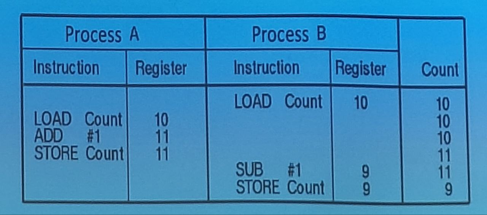
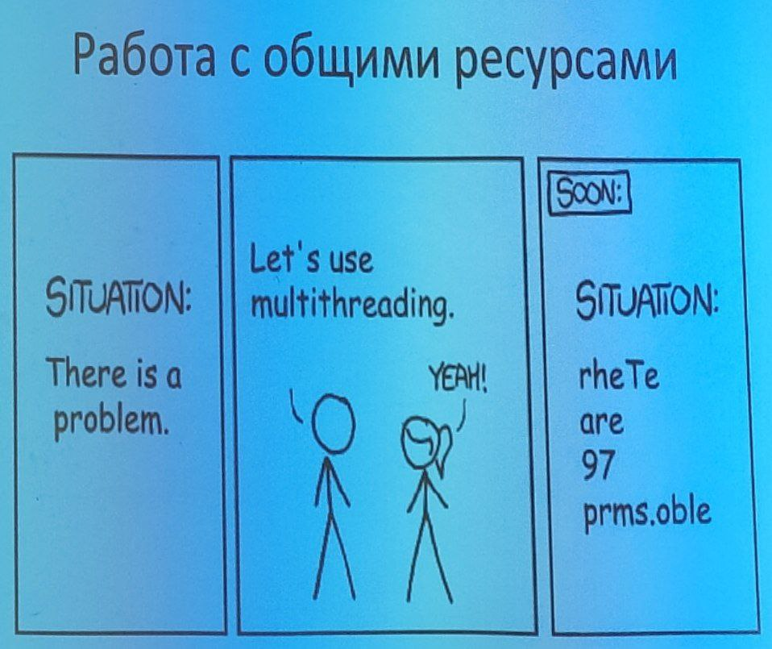

# 15.03.2024

# ОС/Лекция 4

# Методы синхронизации процессов и потоков

## Взаимодействие процессов

<u>Межпроцессное взаимодействие</u> (IPC, Inter-Process Communication):
- передача информации между процессами;
- обеспечение совместной работы процессов без создания взамных помех;
- определение правильной последовательности запуска процессов на основе существующих зависимостей между ними.

Для потоков всё аналогично, только передавать информацию между ними проще, чем между процессами.

Если нет специальных оговорок, в рамках данной лекции можно заменять слово "процесс" на "поток" и обратно.

По-умолчанию, общей памяти процессы не имеют. Рассмотрим два случая:
- взаимодействие потоков из разных процессов;
- взаиодейтсвие потоков в рамках одного процесса;

Также в рамках лекции коснёмся темы запуска поток в нужном порядке в рамках одного процесса.

## Состязательная ситуация (race condition)

Состязательная ситуация (состояние гонки, race condition) - ситуация, при которой два или более процесса считывают или записывают какие-нибудь общие данные, а окночательный результат зависит от того, какой процесс и когда именно выполнялся.

Реализация инкремента и декремента на ассемблере. В правых колонках отображается состояние оперативной памяти. Ответ, полученный в ходе выполнения программы неверен (9, а долно быть 10). 

В примере один процесс раньше другого читает из оперативной памяти Count.

Нужно помнить о том, что программа может получить прерывание в любой момент времени, кроме выполнения ассемблерной инструкции. Сначала будет завершено выполнение текущий инструкции, а уже после запуститься обработка прерывания.

## Критическая область (секция)

Данное понятие описывает фрагмент программы, в котором осуществляется доступ к общим данным.

Пока один поток работает с общим ресурсом, другие потоки вынуждены ждать.

**Взаимное исключение** (mutual exclusion) - правило, при котором, пока общие данные используются одним процессом, возможность их использования другими процессами исключается.

В данном случае удобнее даже рассматривать не общие данные, а общие ресурсы (данные, файлы, УВВ, принтер и т.д.).

Правила для критических секций:
- два процесса не могут одновременно находиться в своих критических областях;
- не должны выстраиваться предположения о количестве и вычислительной мощности процессора(-ов);
- никакие процессы, выполняемые за пределами своих критических областей, не могут блокировать выполнение других процессов...
ну и тут ещё один пункт был, но я не успел его записать.

## Взаимное исключение с активным ожиданием

Данный подход не требует работы с функциями ОС. Но есть и недостаток: в этом случае будут в холостую использоваться такты (ресурсы) процессора.

### Запрет прерываний

- давать пользовательским процессам возможость выключаеть все прырвания неразумно;
- действует только на один центральный процессор, на остальых прерывания продолжают работать
- используется в основном в ядре ОС.

Раз запрещать прерывания неразумно придумаем что-нибудь другое. Введём переменную-флаг, которая будет иметь знания или true, или false. Такая переменная называется блокирующей.

### Блокирующие переменные

Переменная-флаг, подход работает только при отключении прерываний между проверкой значения переменной и её установкой в 1.

### Строгое чередование

пример двух процессов с бесконечными циклами while.

### Алгоритм Петерсона

Вход в критическую секцию и выход из неё.

## Инструкции TSL (test send lock) и XCHG (exchange)

## Семафоры

<u>Семафор</u> - целочисленная переменная для посдчёта количества отложенных активизаций. Предложен Эдсгером Дейкстрой в 1965 г.
- семафор=0 - нет активизаций;
- семафор>0 - ожидается не менее одной активизации.

Инвалидация кеша процессора приведёт к небольшой просадке производительности.

Идея была позаимствована из железнодорожных семафоров.

Атомарные операции над семафором:
- down (cleep, enter, wait): если семафор не равен 0, уменьшает семафор на единицу и продолжает выполнение; если равен 0, выполнение процесса приостанавливается без завершения операции down.
- up (wakeup, leave, post): увеличивает семафор на единицу; если с этим семафором связаны приостановленные процессы, ОС выбирает одни из них и завершает его вызов операции down.

## Мьютексы

Мьютекс - совместно используемся переменная с двумя возможными состояниями: заблокированном и незаблокированном. Мьютекс - это бинарный семафор.

Операции:
- mutex_lock - вызывается перед входом процесса в критическую область; если мьютекс незаблокрирован, он блокирется и выполенение процесса продлжается; если мьютекс уже заблокирован...

### Упрощённая реалиация основных оперций над мьютексом

thread_yield переводит поток в состояние готовности, а не в состояние ожидания.

## Фьютексы

Фьютекс (futext, fast userspace mutex) - быстрый мьютекст в пользовательском пространстве. Смысл в том, чтобы минимизировать кол-во обращений к ОС и, таким образом, минимизировать накладные расходы выполенения.

В Линукс по-умолчанию все мьютексы реализованы через фьютексы.

- переменная с состонием фьюеткса хрнится в пространстве пользователя, т.е. проверка заблокирован ли фьютекс происходит мгновенно;
- выхов системной функциии и переход в пространство ядра происходит тлько если фьютекс заблокирован: нужно сказать ядру, чтобы поток был помещён в состяоние ожидания;
- фьютекс обычно принимает значения: 1 (свободен), 0 (заблокирован), -1 (заблокирован и есть не менее одного потока, ожидающего разблокировки фьютекса);
- при вызове операции unlock? если есть потоки, ожидающие разблокировки фьютекса, будет сделан системный выхов для информация ядра о возможности возобновить один из ожидающих потоков.

Мьютексы и семафоры в бибилиотеке pthreads:

| Функция, вызываемоя из потока | Описание |
| -- | -- |
| pthread_mutex_init | Создание мьютекса |
| pthread_mutex_destroy | Уничтожение существующего мьютекса |

## Условные переменные

## Переменные

## Сообщения

## Потокобезопасность и реентерабельность
